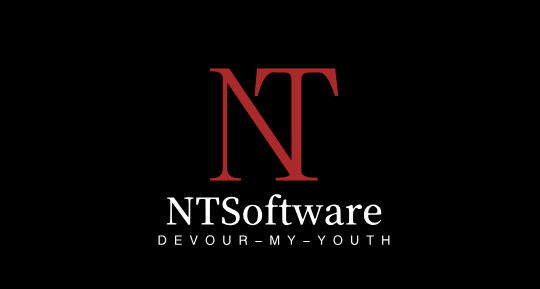

# NTSoftware-Devour-My-Youth 
<p align="center">
  
</p>


# 📖 软工圣经 

### 😄第一章：创世记

1. 初始之时，需求未定，代码未成形，项目经理说：“要有需求”，于是有了一页 Word 文档。
2. 然后他说：“要有架构”，于是学生们熬夜画出了 UML 图。
3. 接着他说：“要敏捷开发”，于是每天开晨会，每周迭代，永远在冲刺。
4. 又说：“要团队协作”，于是有人写了三行代码，有人写了三千行，最后成绩一样。

> 🙏 “我们信的是 Git，版本控制的灵与分支的圣洁。”

 

### 📚第二章：律法书

1. 教授说：“你们当用 Java 编程，不可用 Python。”
2. 又说：“你们当写文档，不可只写代码。”
3. 再说：“你们当做需求分析，不可先敲键盘。”
4. 最后说：“你们当有答辩，不可无声无息提交。”

> 📜 “凡不写文档者，必不能得满分；凡不交周报者，必被约谈。”


### 😭第三章：苦难录

1. 学生夜半不眠，为的是一个 Sprint 的 deadline。
2. 有人因 Git 合并冲突而流泪，有人因组长失踪而崩溃。
3. 更有甚者，连续通宵七日，只为完成课程设计。
4. 有人说：“这只是一个小功能”，结果它吃掉了整个周末。

> 💀 “你若不当软工人，你就不知道什么叫人间炼狱。”


### ✨第四章：寓言篇

1. 有一个学生问老师：“我该怎么做项目？”
   老师说：“你要从用户出发，站在他们的角度思考。”
   学生说：“那我能假装用户是 AI 吗？”
   老师怒斥：“不行！你必须模拟真实场景！”
   于是学生只好虚构了一群用户，并编造了他们的故事。

2. 又有一组学生想用 React 做前端，
   老师说：“你们要用 Vue，这是主流。”
   于是他们用了 Vue，但他们心里还是 React。

> 🧠 “凡坚持技术信仰者，必遭现实毒打。”


### 🌠第五章：启示录

1. 末日将至，答辩来临。
2. 每人五分钟，讲完三年心血。
3. 评委说：“这个功能不够创新。”
4. 组长低头说：“这是我们能想到的最好方案。”
5. 成绩公布，众人沉默，唯有 Git 记录了一切。

> 🔚 “愿后来者看见这段话，提前备份人生。”


### 👋结语：祝福与诅咒

- 凡读此经者，若仍在修软工课，愿你 Git 不丢、组长不跑、需求不变。
- 若已毕业，愿你不再想起那段岁月。
- 若将来成为老师，请记住：你曾也是那个熬夜改需求的学生。


📜 **谨以此文纪念每一位被软工折磨过的人类灵魂**  

🕊️ Rest in peace, our youth.


## 🚀 Get Start

- Python 3.7+
- Neo4j 数据库（本地或远程）
- Git（用于克隆仓库）

```bash
git clone https://github.com/your-repo/DeepSeekAI.git
```

使用 **ctrl+F** 搜索所有的 `NTSoftware-Devour-My-Youth` 换成对应的`username`、`password`、`api_key` 

**创建并激活Python虚拟环境**

```bash
python -m venv venv
source venv/bin/activate  # Linux/MacOS
.\venv\Scripts\activate   # Windows
```

```bash
pip install -r requirements.txt
```

**启动应用：** 在开发模式下启动Flask应用：

```sh
python app.py
```

访问 `http://localhost:5000` 查看主页。
